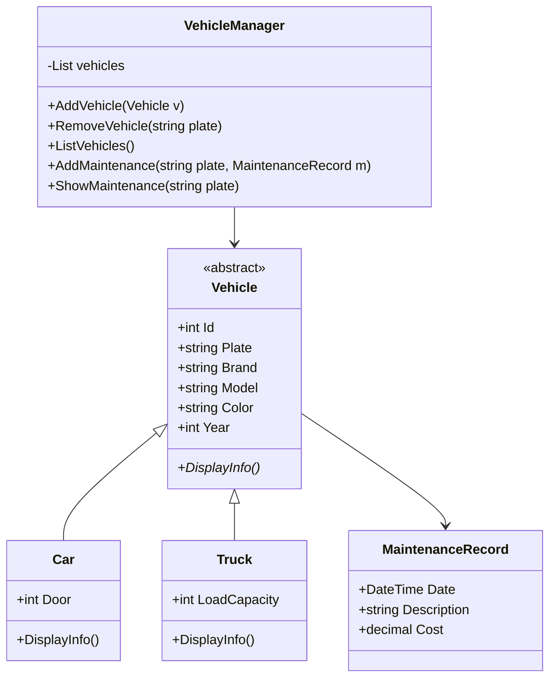

🚗 Vehicle Maintenance Tracker – Araç Bakım Takip Sistemi 🚗

Bu proje, C# ile geliştirilmiş, Nesne Yönelimli Programlama (OOP) prensiplerini temel alan bir araç ve bakım takip uygulamasıdır. Amaç; farklı türde araçları sisteme kaydedebilmek, listeleyebilmek ve araçlara bakım kayıtları ekleyebilmektir.

📌 Projenin Amacı<br>

Bu proje, OOP'in temel kavramlarını uygulamalı olarak öğrenmek için geliştirilmiştir:

* Inheritance (Kalıtım)

* Abstraction (Soyutlama)

* Polymorphism (Çok Biçimlilik)

* Encapsulation (Kapsülleme)

🔧 Özellikler<br>
✔ 1. Araç Yönetimi

Sisteme iki tip araç eklenebilir:

* Car (Araba)

--> Kapı sayısı bilgisi içerir

--> DisplayInfo() metodu kendine özgü şekilde çalışır

* Truck (Kamyon)

-->Yük kapasitesi bilgisi içerir

--> DisplayInfo() metodu kendine özgü şekilde çalışır

📌 Kullanılan OOP Yapıları:

Vehicle (abstract) → ortak özellik ve davranışlar

Car ve Truck → kalıtım yoluyla genişletilmiş sınıflar

DisplayInfo() → polymorphism ile her araçta farklı şekilde uygulanır

✔ 2. VehicleManager — Araç Kaydı Yönetimi

* Sınıfın görevleri:

--> Araç ekleme

--> Araç silme

--> Araç listeleme

--> Ayrıca sistem, aynı plakaya sahip araç eklemeye izin vermez.

```csharp
public bool AddVehicle(Vehicle v)
        {
            if (v == null)
            {
                Console.WriteLine("Araç oluşturulamadı! ");
                return false;
            }
            foreach (Vehicle vehicle in vehicles)
            {
                if (vehicle.Id == v.Id)
                {
                    Console.WriteLine($"{vehicle.Id} numaralı Id zaten kayıtlı !!!");
                    return false;
                }
                if (vehicle.Plate == v.Plate)
                {
                    Console.WriteLine($"{vehicle.Plate} plakasında bir araç zaten kayıtlı !!!");
                    return false;
                }
            }
            vehicles.Add(v);
            return true;
        }
```


✔ 3. Bakım Kayıt Sistemi (Devam Ediyor)

Her araç kendi bakım kayıtlarını tutar.
Bu kayıtlar için MaintenanceRecord sınıfı oluşturulmuştur.

Araç üzerinde:

-> AddRecord()

-> ShowRecords()

metotları bulunur.

VehicleManager içerisinde bakım ekleme ve görüntüleme alt yapısı hazırlanmıştır:

```csharp
public void AddMaintenance(string plate, MaintenanceRecord m) { … }
public void ShowMaintenance(string plate) { … }
```

✔ 4. Menü Sistemi (Program.cs)

Konsol menüsü oluşturulmuştur.
Şu anda aşağıdaki işlemler tamamlanmış durumda:

→ Case 1: Araç Ekleme

 * Araba / Kamyon seçimi

 * TryParse ile tüm sayısal alanların doğrulanması

 * Girilen bilgilere göre doğru sınıftan nesne oluşturma

 * VehicleManager üzerinden ekleme yapılması
<hr>
→ Case 2: Araç Listeleme

 * Tüm araçların DisplayInfo() kullanılarak ekrana yazdırılması

 * Kullanıcı için temiz ekran geçişleri ve geri dönüş mesajları
<hr>
→ Case 3: Araç Silme (Tamamlandı)

 * Araç silme işlemi plaka bilgisine göre yapılmaktadır.

 * Girilen plaka sistemde varsa araç listeden kaldırılır.

 * Araç bulunamazsa kullanıcı bilgilendirilir.

📌 Silme işlemi VehicleManager içerisinde yönetilmektedir.
<hr>
→ Case 4: Bakım Ekleme (Tamamlandı – Geliştirilmiş Akış)

 * Bakım ekleme süreci kullanıcı deneyimi dikkate alınarak iyileştirilmiştir:

 * Önce plaka bilgisi alınır

 * Plaka sistemde yoksa:

   - Diğer alanlar (tarih, açıklama, ücret) hiç sorulmaz

   - “Araç bulunamadı” mesajı gösterilir

 * Plaka varsa:

   - Tarih bilgisi DateTime.TryParse ile doğrulanır

   - Açıklama bilgisi alınır

   - Ücret bilgisi int.TryParse ile kontrol edilir

   - Bakım kaydı ilgili araca eklenir

Bu yapı sayesinde:

* Gereksiz veri girişi engellenmiştir

* Hatalı kullanıcı akışı önlenmiştir
<hr>
→  Case 5: Bakım Geçmişini Gösterme

 * Kullanıcıdan plaka bilgisi alınır

 * Araç bulunursa:

   - O araca ait tüm bakım kayıtları listelenir

 * Araç bulunamazsa:

   - Bilgilendirici mesaj gösterilir

Bakım kayıtları araç bazlı tutulduğu için her araç kendi geçmişini ayrı ayrı gösterir.
<hr>
📁 **Proje Yapısı**

```
VehicleMaintenanceTracker/
│
├── Vehicle.cs
│   → Soyut (abstract) temel sınıf
│   → Ortak araç özellikleri (Id, Plate, Brand, Model, Color, Year)
│   → DisplayInfo() abstract metodu
│
├── Car.cs
│   → Vehicle sınıfından türetilmiştir
│   → Door (Kapı Sayısı) özelliği içerir
│   → DisplayInfo() override edilmiştir
│
├── Truck.cs
│   → Vehicle sınıfından türetilmiştir
│   → LoadCapacity (Yük Kapasitesi) özelliği içerir
│   → DisplayInfo() override edilmiştir
│
├── MaintenanceRecord.cs
│   → Bir araca ait tek bir bakım kaydını temsil eder
│   → Date (DateTime), Description, Cost alanlarını içerir
│
├── VehicleManager.cs
│   → Araç listesini yönetir
│   → Araç ekleme, silme, listeleme işlemleri
│   → Bakım ekleme ve bakım geçmişi gösterme işlemleri
│
└── Program.cs
    → Konsol menüsü
    → Kullanıcıdan veri alma ve akış kontrolü
    → Case 1–5 işlemleri tamamen çalışır durumdadır
```


📅 Şu Ana Kadar Tamamlanan Adımlar

✔ Adım 1: Vehicle + Car + Truck sınıfları

✔ Adım 2: VehicleManager (add, remove, list)

✔ Adım 3: MaintenanceRecord + Vehicle bakım sistemi altyapısı

✔ Adım 4: Display & kayıt gösterme altyapısı

✔ Adım 5: Menü sistemi (Program.cs)

 * Case 1: Araç Ekleme

 * Case 2: Araç Listeleme

 * Case 3: Araç Silme

 * Case 4: Bakım Ekleme

 * Case 5: Bakım Geçmişini Gösterme

-----------------------------------------------------------------------------------------------

📌 Vehicle Maintenance Tracker – UML Diyagramı
Sınıf Diyagramı (UML Class Diagram)



📌 Açıklamalar<br>
* Vehicle (Abstract Class)

-> Temel araç özelliklerini içerir.

-> DisplayInfo() methodu abstract → alt sınıflar zorunlu olarak override eder.

* Car ve Truck

-> Vehicle sınıfından kalıtım alır.

-> Her biri kendine özgü alanlara sahiptir (kapı sayısı, yük kapasitesi).

-> Kendi DisplayInfo formatını uygular.

* MaintenanceRecord

-> Bir aracın bakım geçmişindeki tek bir kaydı temsil eder.

* VehicleManager

-> Araç listesi tutar.

-> Araç ekleme, silme, listeleme işlemlerini yapar.

-> Bakım kaydı ekleme ve gösterme operasyonları olacaktır.
