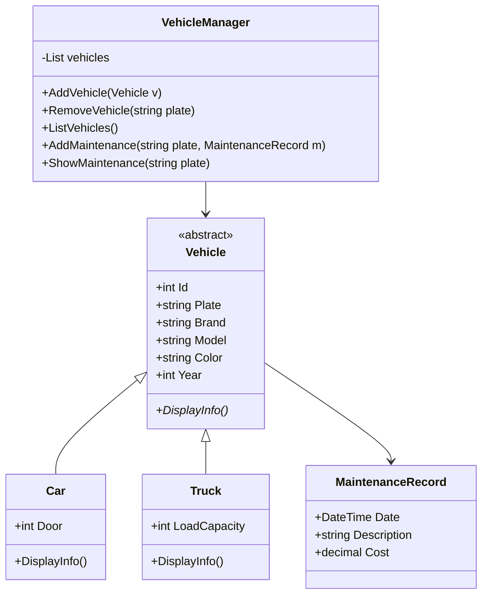

🚗 Vehicle Maintenance Tracker – Araç Bakım Takip Sistemi 🚗

Bu proje, C# ile geliştirilmiş, Nesne Yönelimli Programlama (OOP) prensiplerini temel alan bir araç ve bakım takip uygulamasıdır. Amaç; farklı türde araçları sisteme kaydedebilmek, listeleyebilmek ve araçlara bakım kayıtları ekleyebilmektir.

📌 Projenin Amacı<br>

Bu proje, OOP'in temel kavramlarını uygulamalı olarak öğrenmek için geliştirilmiştir:

* Inheritance (Kalıtım)

* Abstraction (Soyutlama)

* Polymorphism (Çok Biçimlilik)

* Encapsulation (Kapsülleme)

🔧 Özellikler<br>
✔ 1. Araç Yönetimi

Sisteme iki tip araç eklenebilir:

* Car (Araba)

--> Kapı sayısı bilgisi içerir

--> DisplayInfo() metodu kendine özgü şekilde çalışır

* Truck (Kamyon)

-->Yük kapasitesi bilgisi içerir

--> DisplayInfo() metodu kendine özgü şekilde çalışır

📌 Kullanılan OOP Yapıları:

Vehicle (abstract) → ortak özellik ve davranışlar

Car ve Truck → kalıtım yoluyla genişletilmiş sınıflar

DisplayInfo() → polymorphism ile her araçta farklı şekilde uygulanır

✔ 2. VehicleManager — Araç Kaydı Yönetimi

* Sınıfın görevleri:

--> Araç ekleme

--> Araç silme

--> Araç listeleme

--> Ayrıca sistem, aynı plakaya sahip araç eklemeye izin vermez.

```csharp
public void AddVehicle(Vehicle v)
{
    foreach (Vehicle vehicle in vehicles)
    {
        if (vehicle.Plate == v.Plate)
        {
            Console.WriteLine("Bu plakada bir araç zaten kayıtlı !!!");
            return;
        }
    }

    vehicles.Add(v);
    Console.WriteLine("Araç başarıyla eklendi :)");
}
```


✔ 3. Bakım Kayıt Sistemi (Devam Ediyor)

Her araç kendi bakım kayıtlarını tutar.
Bu kayıtlar için MaintenanceRecord sınıfı oluşturulmuştur.

Araç üzerinde:

-> AddRecord()

-> ShowRecords()

metotları bulunur.

VehicleManager içerisinde bakım ekleme ve görüntüleme alt yapısı hazırlanmıştır:

```csharp
public void AddMaintenance(string plate, MaintenanceRecord m) { … }
public void ShowMaintenance(string plate) { … }
```

📌 Bu özellik geliştirme aşamasındadır.

✔ 4. Menü Sistemi (Program.cs)

Konsol menüsü oluşturulmuştur.
Şu anda aşağıdaki işlemler tamamlanmış durumda:

→ Case 1: Araç Ekleme

 * Araba / Kamyon seçimi

 * TryParse ile tüm sayısal alanların doğrulanması

 * Girilen bilgilere göre doğru sınıftan nesne oluşturma

 * VehicleManager üzerinden ekleme yapılması

→ Case 2: Araç Listeleme

 * Tüm araçların DisplayInfo() kullanılarak ekrana yazdırılması

 * Kullanıcı için temiz ekran geçişleri ve geri dönüş mesajları

📌 Case 3–5 (Araç Sil, Bakım Ekle, Bakım Göster) kısımları tamamlanacaktır.

📁 **Proje Yapısı**

```
VehicleMaintenanceTracker/
│
├── Vehicle.cs              → Soyut temel sınıf
├── Car.cs                  → Car sınıfı
├── Truck.cs                → Truck sınıfı
├── VehicleManager.cs       → Araç yönetimi
├── MaintenanceRecord.cs    → Bakım kayıt modeli
└── Program.cs              → Konsol menüsü ve işlem akışı (gelecek adımlarda devam edecektir)
```


📅 Şu Ana Kadar Tamamlanan Adımlar

✔ Adım 1: Vehicle + Car + Truck sınıfları

✔ Adım 2: VehicleManager (add, remove, list)

✔ Adım 3: MaintenanceRecord + Vehicle bakım sistemi altyapısı

✔ Adım 4: Display & kayıt gösterme altyapısı

✔ Adım 5: Menü – Case 1 ve Case 2 işlemleri tamamlandı
⏳ Case 3, 4 ve 5 – DEVAM EDİLECEK

-----------------------------------------------------------------------------------------------

📌 Vehicle Maintenance Tracker – UML Diyagramı
Sınıf Diyagramı (UML Class Diagram)



📌 Açıklamalar<br>
* Vehicle (Abstract Class)

-> Temel araç özelliklerini içerir.

-> DisplayInfo() methodu abstract → alt sınıflar zorunlu olarak override eder.

* Car ve Truck

-> Vehicle sınıfından kalıtım alır.

-> Her biri kendine özgü alanlara sahiptir (kapı sayısı, yük kapasitesi).

-> Kendi DisplayInfo formatını uygular.

* MaintenanceRecord

-> Bir aracın bakım geçmişindeki tek bir kaydı temsil eder.

* VehicleManager

-> Araç listesi tutar.

-> Araç ekleme, silme, listeleme işlemlerini yapar.

-> Bakım kaydı ekleme ve gösterme operasyonları olacaktır.
